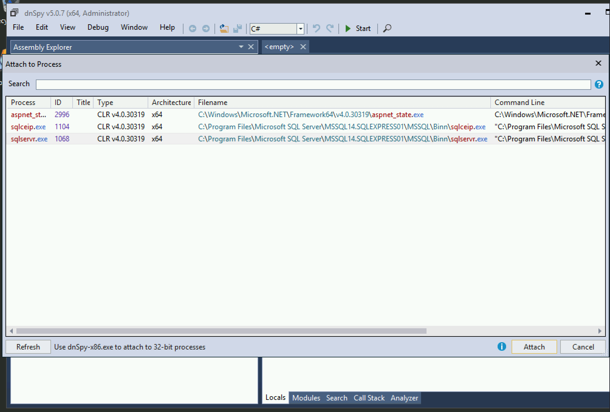
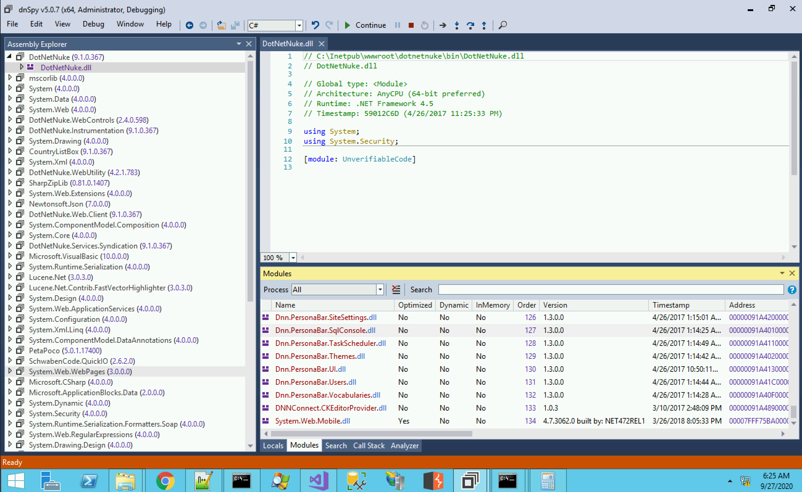
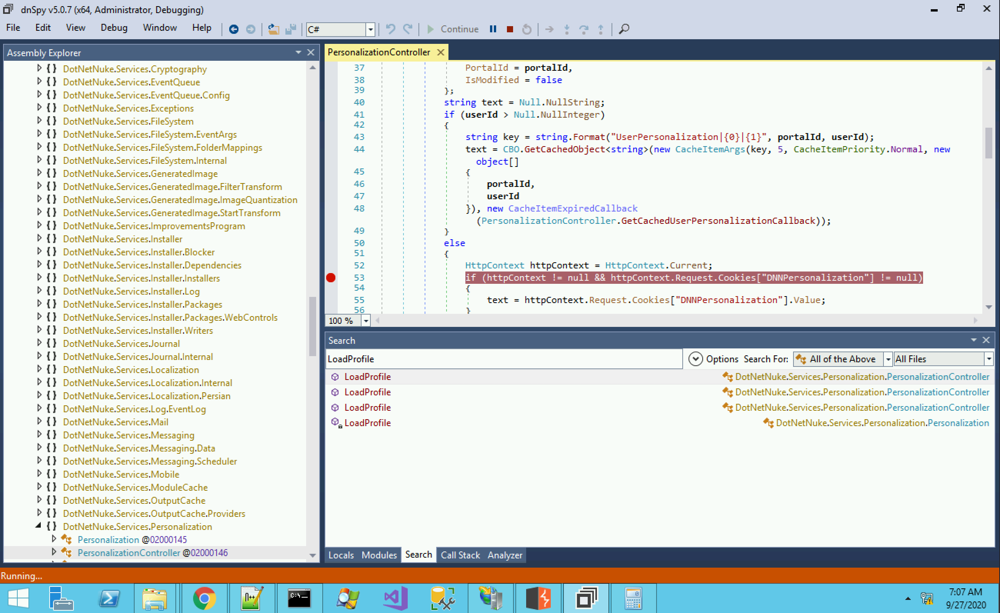
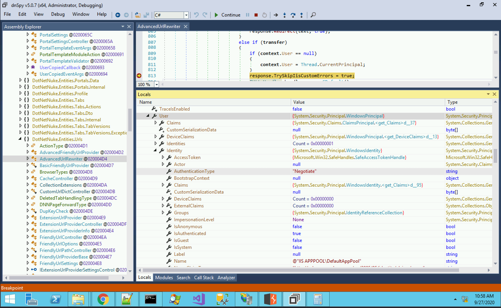
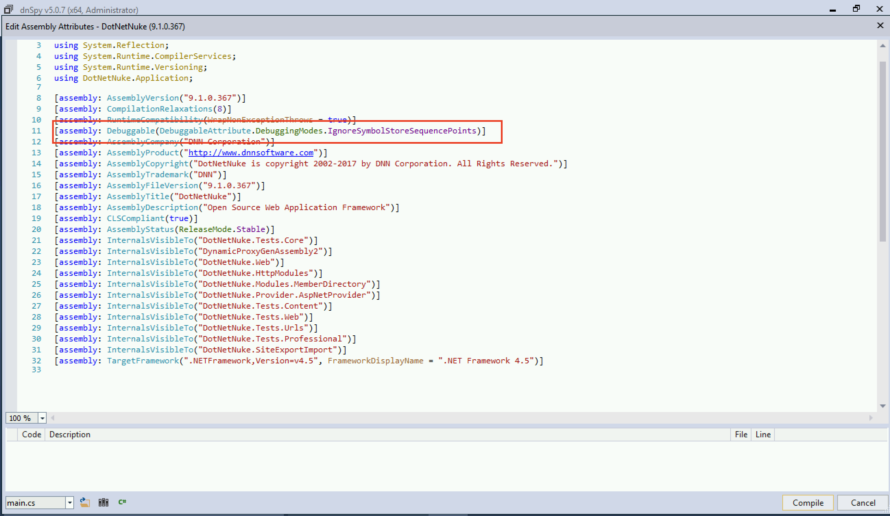
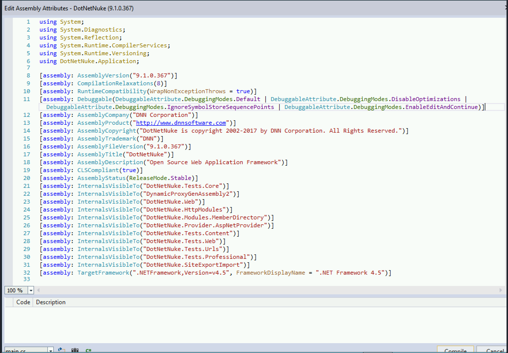

# dnSpy, .NET Debugger

1. 開啟 GUI
```
> .\dnspy.exe
```

2. File > Close All 清除當前工作區的 Module

3. Debug > Attach to Process 選一個 process 掛上去 ( 建議是選有開 debug 的 ex. 用 dnspy 魔改 DotNetNuke.dll 後的 w3wp.exe )



4. 趁想 Debug 的 Module 被載入時按下暫停



5. 下斷點



6. 除錯時間 ~ GUI 的好處是一目了然



## 魔改的方式

Assembly explorer > 右鍵 Edit Assembly Attributes (c#)



新增以下設定
```csharp
[assembly: Debuggable(DebuggableAttribute.DebuggingModes.Default | DebuggableAttribute.DebuggingModes.DisableOptimizations | DebuggableAttribute.DebuggingModes.IgnoreSymbolStoreSequencePoints | DebuggableAttribute.DebuggingModes.EnableEditAndContinue)]
```



改完存檔後, 要記得重啟使用該 Lib 的服務/執行檔.

## Github Page

https://github.com/dnSpy/dnSpy
