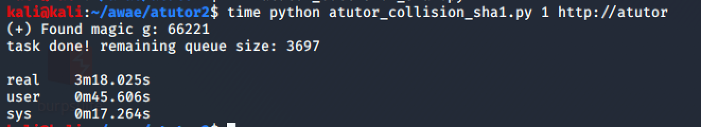

# Utilities

## parallel.py

Very efficient multi-threading API.

### Rough benchmark

Total: 20000 rounds.

**4** threads

complete 2669 rounds in 6 min 13 sec

Avg. 7.1 rounds per sec

```python
parallel.run(__try, range(50000, 70000), verb=True, thread_num=4)
```


**64** threads

complete 16303 rounds in 3 min 18 sec

Avg. 82.3 rounds per sec

```python
parallel.run(__try, range(50000, 70000), verb=True, thread_num=64)
```



